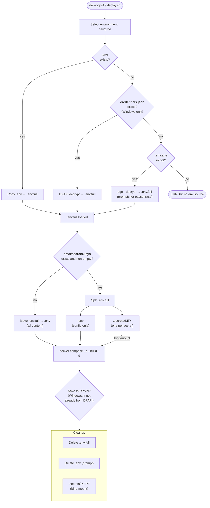

# Knowledge: Full Deploy Flow (deploy.ps1 / deploy.sh)

## Overview

The deploy scripts are the primary entry point for standing up Docker containers
with secrets. They orchestrate a 3-step interactive flow: select environment,
load secrets from a tiered source priority, split secrets from config, start
containers, and clean up transient files.

**Languages:** PowerShell 5.1+ (Windows), Bash 4+ (Linux)
**Entry points:** `deploy.ps1`, `deploy.sh`
**Run from:** `<project>/secure-env-handle-and-deploy/`
**Operates on:** parent project directory

**Key invariant:** When `envs/secrets.keys` exists, `.env` **never** contains
secret values on disk -- not even temporarily. All sources load into `.env.full`
(intermediate), which is split into `.env` (config only) + `.secrets/` (secrets).

---

## Implementation Details

### Execution Phases

The deploy flow has 5 distinct phases:

```
[1] Select environment (dev/prod)
         |
[2] Load env → .env.full (3-tier priority)
         |
[3] Split .env.full → .env (config) + .secrets/ (secrets)
         |                ↑ no manifest → move .env.full → .env
[4] docker compose up --build -d
         |
[5] Cleanup: DPAPI save offer, delete .env + .env.full, keep .secrets/
```

### Phase 1: Environment Selection (interactive)

User selects `dev` or `prod`. This determines which encrypted files to look for:
- `envs/dev.env.age` or `envs/prod.env.age`
- `envs/dev.credentials.json` or `envs/prod.credentials.json`

### Phase 2: Three-Tier Source Loading

All sources write to `.env.full` -- never directly to `.env`.

| Priority | Source | File checked | Windows | Linux |
|----------|--------|-------------|---------|-------|
| 1 | Existing `.env` | `.env` | Copy → `.env.full` | Copy → `.env.full` |
| 2 | DPAPI credential store | `envs/{env}.credentials.json` | Decrypt each entry → `.env.full` | N/A |
| 3 | age-encrypted file | `envs/{env}.env.age` | `age --decrypt` → `.env.full` | `age --decrypt` → `.env.full` |

**Priority 1 rationale:** An existing `.env` represents manual edits the user
wants to deploy. It takes precedence over automated stores.

**DPAPI decryption (Windows):** Each key-value pair is individually encrypted
with `ProtectedData.Unprotect()` (CurrentUser scope). The JSON file contains
`{ "KEY": "base64-encrypted-bytes" }`. Decryption is zero-prompt but
machine+user-bound.

**age decryption:** Prompts for passphrase interactively. Uses scrypt KDF +
ChaCha20-Poly1305. The `.age` files are committed to git.

### Phase 3: Secret Splitting

The `Split-EnvSecrets` / `split_env_secrets` function:

1. Reads `envs/secrets.keys` manifest (one key name per line)
2. If absent or empty: returns false → caller moves `.env.full` → `.env`
3. Creates `.secrets/` directory (SH: `chmod 700`)
4. Parses `.env.full` line by line:
   - Comments/blanks → config
   - `KEY=VALUE` where KEY in manifest → write VALUE to `.secrets/KEY`
   - `KEY=VALUE` where KEY not in manifest → config
5. Writes config-only lines to `.env` (secrets never touch this file)

**Secret file format:** Raw value, no `KEY=` prefix, no trailing newline.
PS1 uses `[System.IO.File]::WriteAllText()`, SH uses `printf '%s'`.

### Phase 4: Docker Compose Up

```
docker compose up --build -d
```

Docker Compose reads:
- `.env` via `env_file: [.env]` -- config values baked into container environment
- `.secrets/KEY` via `secrets: file:` -- bind-mounted to `/run/secrets/key`

**Critical:** `env_file:` values are read once at up-time (file can be deleted).
`secrets: file:` creates a persistent bind mount (files must exist while
containers run).

### Phase 5: Cleanup

| File | Action | Why |
|------|--------|-----|
| `.env.full` | Always deleted | Intermediate; contains all secrets in cleartext |
| `.env` | Deleted (auto if from DPAPI, prompt otherwise) | Already read by docker compose; config-only |
| `.secrets/` | **Kept** | Bind-mounted into containers; needed for restarts |
| DPAPI save | Offered if source wasn't DPAPI (Windows only) | Zero-prompt deploys next time |

**`.secrets/` lifecycle:** Created by deploy, persists while containers run,
cleaned up by `env-run` when running `docker compose down` (detected via
`\bdown\b` pattern match).

**DPAPI save detail:** Reads from `.env.full` (complete key set including
secrets) before it's deleted. Each value is encrypted individually with
`ProtectedData.Protect()` and stored as Base64 in the JSON file.

---

## Dependencies

### Files Consumed

| File | Required | Producer |
|------|----------|----------|
| `envs/{env}.env.age` | No (tier 3) | `encrypt-env.ps1` / `.sh` |
| `envs/{env}.credentials.json` | No (tier 2, Windows) | `store-env-to-credentials.ps1` |
| `.env` | No (tier 1) | User-created or `decrypt-env` / `generate-env-from-credentials` |
| `envs/secrets.keys` | No (opt-in split) | User-created or `/suggest-secret-variable-split` skill |

### Files Produced (transient)

| File | Lifetime | Content |
|------|----------|---------|
| `.env.full` | Load → cleanup | All key-value pairs (config + secrets) |
| `.env` | Split → cleanup | Config-only entries (no secrets) |
| `.secrets/{KEY}` | Split → `docker compose down` | Raw secret values (one per file) |
| `envs/{env}.credentials.json` | Permanent (if user accepts DPAPI save) | DPAPI-encrypted entries |

### External Dependencies

| Dependency | When needed | Purpose |
|------------|-------------|---------|
| `age` CLI | Tier 3 (age decryption) | Passphrase-based encryption |
| `docker` + `docker compose` | Phase 4 | Container orchestration |
| `System.Security` (.NET) | Tier 2 + DPAPI save (Windows) | DPAPI encryption/decryption |

---

## Visual Diagrams

### End-to-End Deploy Flow



### File Lifecycle During Deploy

```
Time →   Load          Split         Compose        Cleanup
         ─────         ─────         ───────        ───────
.env.full  ██████████████████████████████████████░░░░  (deleted)
.env       ░░░░░░░░░░░░██████████████████████████░░░░  (deleted)
.secrets/  ░░░░░░░░░░░░██████████████████████████████  (persists)

██ = exists on disk    ░░ = does not exist
```

### Platform Differences

```
                    Windows (deploy.ps1)         Linux (deploy.sh)
                    ────────────────────         ─────────────────
Source tiers        .env → DPAPI → age           .env → age
DPAPI support       Yes                          No
DPAPI save offer    Yes (after deploy)           No
.env delete         Auto (DPAPI) or prompt       Prompt
.secrets perms      Default NTFS ACLs            chmod 700
```

---

## Additional Insights

### Security Properties

- **Secrets never in `.env`**: The `.env.full` intermediate is the only file that
  contains all secrets in cleartext. It's deleted immediately after use.
- **`.secrets/` exposure**: Individual files persist while containers run. They
  are not visible via `docker inspect`, `docker logs`, or `/proc/*/environ`
  (unlike env vars). SH version restricts to owner-only access.
- **DPAPI is machine-bound**: The credential store is useless if stolen --
  cannot be decrypted on another machine or by another user.
- **Passphrase not stored**: The age passphrase is entered interactively and
  never written to disk by these scripts (stored externally in PasswordDepot).

### Error Handling

- `$ErrorActionPreference = "Stop"` (PS1) / `set -euo pipefail` (SH) --
  any unhandled error terminates the script
- age decryption failure: checked via `$LASTEXITCODE` / exit status
- docker compose failure: checked via `$LASTEXITCODE` (PS1 only; SH relies on
  `set -e`)
- No rollback: if docker compose fails, `.env` and `.env.full` remain on disk.
  The user must manually clean up or re-run.

### Design Decisions

- **Interactive, not scriptable**: deploy is designed for human operators. For
  scriptable deployments, use `env-run.ps1 dev "docker compose up --build -d"`.
- **Split helper is duplicated**: The same function exists in deploy.ps1,
  deploy.sh, env-run.ps1, env-run.sh. No shared module -- each script is
  self-contained.
- **`.env.full` as intermediate**: All sources converge to a single file before
  splitting. This eliminates the window where `.env` would contain secrets and
  simplifies the split function (always reads from one file format).
- **`.secrets/` kept after deploy**: Docker Compose `secrets: file:` creates
  bind mounts that must persist for the container lifetime. Cleaning up on
  `docker compose down` (via env-run) is the only safe time.

### Relationship to env-run

`env-run.ps1`/`.sh` uses the exact same loading + splitting logic but is
scriptable (takes env name + command as args). Key differences:

| Aspect | deploy | env-run |
|--------|--------|---------|
| Environment selection | Interactive prompt | CLI argument |
| Command | Fixed: `docker compose up --build -d` | User-provided |
| DPAPI save offer | Yes | No |
| `.env` cleanup | Prompt or auto (DPAPI) | Auto if created by script |
| `.secrets/` cleanup | Never | Only on `down` commands |
| Safety gates | None | Confirms `migrate` / `reset` |

---

## Metadata

| Field | Value |
|-------|-------|
| Analysis date | 2026-03-30 |
| Depth | Full (all branches, both platforms, all 5 phases) |
| Files analyzed | deploy.ps1, deploy.sh, env-run.ps1, env-run.sh, encrypt-env.ps1, store-env-to-credentials.ps1, init-env-handle.ps1 |
| Repo version | v1.6.0 (split-first + persistent .secrets/) |
| Related knowledge | [knowledge-docker-secrets-split.md](knowledge-docker-secrets-split.md), [knowledge-env-workflow-scripts.md](knowledge-env-workflow-scripts.md) |

---

## Next Steps

- **Test persistent `.secrets/`**: Deploy a project with secrets.keys, restart a container, verify `/run/secrets/` files are still accessible
- **Windows `.secrets/` permissions**: Consider adding explicit ACL restriction (currently relies on default NTFS permissions)
- **Crash recovery**: If deploy fails mid-flow, `.env.full` may remain on disk with secrets. Consider a cleanup-on-start guard
- **env-run `down` detection edge case**: `docker compose down` without `env-run` (direct invocation) won't clean up `.secrets/`. Document this as a known limitation or add a cleanup skill
