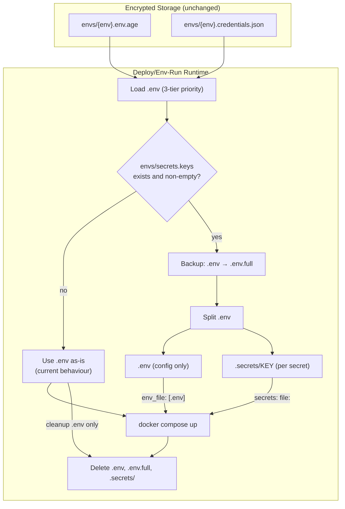

# Knowledge: Docker Secrets Split Feature

## Overview

The Docker secrets split feature allows sensitive environment variables to be
mounted as files via `/run/secrets/` instead of injected as container env vars.
It is controlled by a manifest file (`envs/secrets.keys`) and is **fully backward
compatible** -- absent or empty manifest means identical behaviour to before.

**Added in:** v1.5.0
**Languages:** PowerShell 5.1+ (Windows), Bash 4+ (Linux)
**Touchpoints:** deploy, env-run, verify-env, init-env-handle, CLAUDE.md/.cursorrules

---

## Implementation Details

### Manifest File

**Path:** `envs/secrets.keys` (per project, committed to git)

Format: one key name per line. Comments (`#`) and blank lines are ignored.

```
# Database
POSTGRES_PASSWORD

# API tokens
WECLAPP_API_TOKEN
SECRET_KEY
```

Single manifest shared across all environments (dev/prod). A key is either a
secret or it isn't -- environment doesn't change the classification.

### Split Helper Functions

Identical logic in 4 scripts (duplicated, not shared):

| Script | Function | Return |
|--------|----------|--------|
| `deploy.ps1` | `Split-EnvSecrets` | `$true` / `$false` |
| `env-run.ps1` | `Split-EnvSecrets` | `$true` / `$false` |
| `deploy.sh` | `split_env_secrets` | exit 0 / exit 1 |
| `env-run.sh` | `split_env_secrets` | exit 0 / exit 1 |

### Split Logic (step by step)

```
1. Read envs/secrets.keys
   ↓ absent or empty? → return false (no-op)
   ↓
2. Backup: cp .env → .env.full
   ↓
3. Create .secrets/ directory
   (SH: chmod 700 for restrictive permissions)
   ↓
4. Parse .env line by line:
   - Comment/blank → keep in config lines
   - KEY=VALUE where KEY is in manifest → write VALUE to .secrets/KEY
   - KEY=VALUE where KEY is NOT in manifest → keep in config lines
   ↓
5. Rewrite .env with config-only lines
   ↓
6. Display: "Secrets: N key(s) -> .secrets/"
   ↓
7. Return true (split was performed)
```

### Secret File Format

- **Path:** `.secrets/{KEY}` (e.g., `.secrets/POSTGRES_PASSWORD`)
- **Content:** raw value only, no `KEY=` prefix
- **No trailing newline:** PS1 uses `[System.IO.File]::WriteAllText()`, SH uses `printf '%s'`
- **Filenames:** UPPERCASE, matching .env key names exactly

### Integration Points

#### deploy.ps1 / deploy.sh

```
Load .env (3-tier priority) → Split-EnvSecrets → docker compose up → cleanup
                                                                        ↓
                                              delete .env, .env.full, .secrets/
```

**DPAPI save fix:** When saving to credential store after split, deploy.ps1
reads from `.env.full` (the backup) instead of the rewritten `.env`, so all
keys (including secrets) are stored in DPAPI.

#### env-run.ps1 / env-run.sh

```
Load .env → Split-EnvSecrets → run command → finally: cleanup
                                                ↓
                                  delete .env (if created), .env.full, .secrets/
```

Cleanup is in the `finally` block (PS1) or `trap EXIT` (SH), so it runs even
if the command fails.

#### verify-env.ps1 / verify-env.sh

Does NOT perform a split. Instead:
- Reads `envs/secrets.keys` if present
- Adds a "type" column (`secret` / `config`) to the comparison table
- Warns if a manifest key doesn't exist in any layer
- Heuristic suggestions: warns if a key name contains `PASSWORD`, `SECRET`,
  `TOKEN`, `CREDENTIAL`, `PRIVATE`, or ends with `_API_KEY` but is NOT in
  the manifest

#### init-env-handle.ps1 / init-env-handle.sh

- Added `.secrets/` to the required gitignore entries list
- No other changes

### Cleanup Behaviour

| File | Created by | Deleted when |
|------|-----------|-------------|
| `.env.full` | Split helper (backup before split) | Always: deploy cleanup / env-run finally |
| `.secrets/` | Split helper | Only if split was performed (`$secretsSplit` / `$secrets_split` flag) |
| `.env` | 3-tier load (unchanged) | Existing logic: auto-delete if created, prompt if pre-existing |

The "only cleanup if we created it" pattern prevents deleting a `.secrets/`
directory that existed before the script ran (though this is unlikely).

---

## Dependencies

### Files consumed

| File | Required | Purpose |
|------|----------|---------|
| `envs/secrets.keys` | No (feature is opt-in) | Lists which keys are secrets |
| `.env` | Yes (loaded by 3-tier priority) | Source of all key-value pairs |

### Files produced (transient)

| File | Lifetime |
|------|----------|
| `.env.full` | Created before split, deleted after deploy/env-run |
| `.secrets/{KEY}` | Created during split, deleted after deploy/env-run |
| `.env` (rewritten) | Overwritten during split to remove secret keys |

### docker-compose.yml (user-managed)

The deploy script does NOT modify compose files. Users add the `secrets:`
section manually (or via the `/suggest-secret-variable-split` skill):

```yaml
secrets:
  postgres_password:
    file: .secrets/POSTGRES_PASSWORD    # UPPERCASE filename

services:
  app:
    env_file: [.env]                    # non-secret config
    secrets:
      - postgres_password              # lowercase Docker secret name
    # Inside container: /run/secrets/postgres_password
```

---

## Visual Diagrams

### Data Flow (with secrets split)



### Naming Convention

```
.env key name:     POSTGRES_PASSWORD          (UPPERCASE)
Secret file:       .secrets/POSTGRES_PASSWORD (UPPERCASE, matches key)
Compose secret:    postgres_password          (lowercase, Docker convention)
Container path:    /run/secrets/postgres_password (lowercase)
```

---

## Additional Insights

### Security Considerations

- `.secrets/` files and `.env.full` exist briefly on disk, same exposure as `.env`
- SH version creates `.secrets/` with `chmod 700` (owner-only access)
- PS1 version relies on Windows ACLs (no explicit chmod equivalent needed)
- Docker mounts secrets as tmpfs inside the container -- not written to the container filesystem layer
- Key names in the manifest are not sensitive -- safe to commit to git

### Design Decisions

- **Function duplication across 4 scripts**: The split helper is copy-pasted into
  deploy.ps1, deploy.sh, env-run.ps1, env-run.sh rather than sourced from a
  shared file. This keeps each script self-contained (no import dependencies).
- **Backup before split**: `.env.full` is created so the DPAPI save (in deploy.ps1)
  can store the complete set of keys, and as a safety net if deploy crashes mid-split.
- **No trailing newline in secret files**: Docker reads the file content as-is.
  A trailing newline would become part of the secret value, breaking password checks.
- **Manifest is project-level, not per-environment**: A key is either sensitive or
  it isn't -- the classification doesn't change between dev and prod.
- **Heuristic suggestions are non-blocking**: verify-env suggests keys that look
  sensitive but aren't in the manifest. It doesn't error -- the user decides.
- **`KEY` heuristic is treated as uncertain**: Too broad (matches `CACHE_KEY`,
  `PRIMARY_KEY`). Only `_API_KEY` suffix is auto-classified as secret.

### Backward Compatibility

100% backward compatible. The feature activates only when `envs/secrets.keys`
exists AND contains at least one non-empty, non-comment line. Otherwise:
- `Split-EnvSecrets` / `split_env_secrets` returns false immediately
- No `.secrets/` directory is created
- No `.env.full` backup is created
- No cleanup of `.secrets/` is attempted
- verify-env skips the type column and heuristic suggestions

---

## Metadata

| Field | Value |
|-------|-------|
| Analysis date | 2026-03-27 |
| Depth | Full (all 4 split implementations, verify-env integration, init-env-handle, docs) |
| Files analyzed | deploy.ps1, deploy.sh, env-run.ps1, env-run.sh, verify-env.ps1, verify-env.sh, init-env-handle.ps1, init-env-handle.sh, CLAUDE.md |
| Repo version | v1.5.0 |
| Related knowledge | [knowledge-env-workflow-scripts.md](knowledge-env-workflow-scripts.md), [knowledge-repo-overview.md](knowledge-repo-overview.md) |
| Feature docs | [feature-docker-secrets requirements](../requirements/feature-docker-secrets.md), [design](../design/feature-docker-secrets.md), [planning](../planning/feature-docker-secrets.md) |

---

## Next Steps

- **Test with a real project**: Run deploy with a populated `envs/secrets.keys` in one of the sobekon projects to validate the end-to-end flow
- **App code migration patterns**: Document common patterns for reading from `/run/secrets/` in Python (Django, pydantic), JavaScript, and Go
- **`/suggest-secret-variable-split` skill testing**: Run the skill in a target project and verify its classification accuracy
