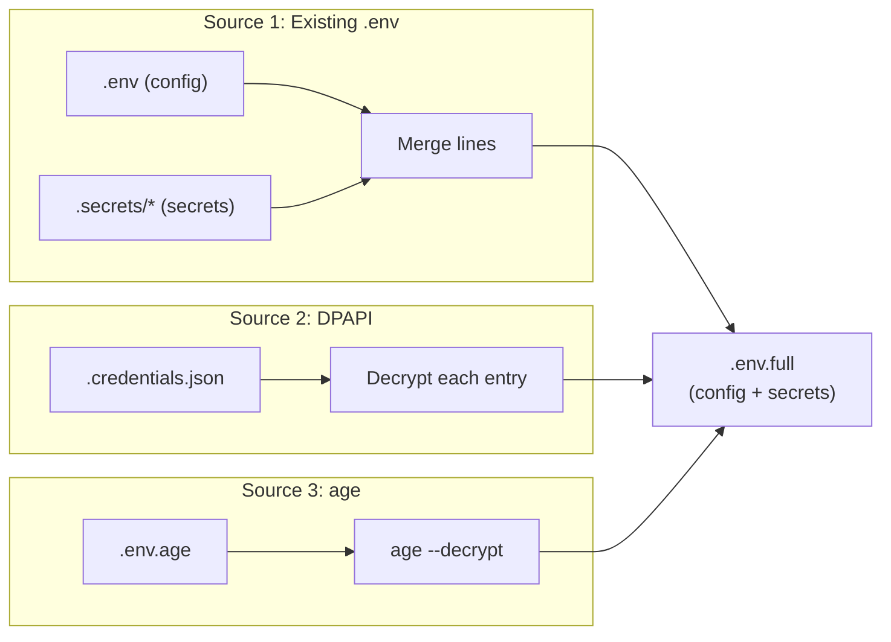

# Knowledge: The .env.full Lifecycle

## Overview

`.env.full` is a **transient intermediate file** that contains the complete set
of environment entries (config + secrets) in `KEY=VALUE` format. It exists so
that the split function has a single unified source to read from, and so that
the DPAPI credential save has access to all entries including secrets.

**Key invariant:** `.env.full` is the ONLY file that ever contains secrets in
plaintext `KEY=VALUE` format on disk. `.env` never has secrets. `.secrets/`
has raw values without keys. `.env.full` bridges the two worlds.

**Lifetime:** Created during deploy/env-run loading, consumed by split + DPAPI
save, deleted during cleanup. Typically exists for seconds.

---

## Implementation Details

### Who Creates .env.full

| Script | Source | How .env.full is created |
|--------|--------|-------------------------|
| `deploy.ps1` / `.sh` | Existing `.env` | Merge: read `.env` lines + append `.secrets/*` as `KEY=value` |
| `deploy.ps1` / `.sh` | DPAPI store | Decrypt all entries → write as `KEY=value` lines |
| `deploy.ps1` / `.sh` | age `.env.age` | `age --decrypt --output .env.full file.age` |
| `env-run.ps1` / `.sh` | Same 3 sources | Same logic as deploy |
| `decrypt-env.ps1` / `.sh` | age `.env.age` | Uses a temp file (`[IO.Path]::GetTempFileName()`), NOT `.env.full` |
| `encrypt-env.ps1` / `.sh` | `.env` + `.secrets/` | Uses a temp file, NOT `.env.full` |

**Critical detail:** When loading from "existing `.env`", the script MUST merge
`.secrets/` back in. Without this merge, `.env.full` only contains config and
the split finds 0 secrets — wiping `.secrets/` clean. This was the root cause
of the v1.6.0–v1.6.12 bug where secrets disappeared on deploy.

### Who Reads .env.full

| Consumer | Purpose |
|----------|---------|
| `Split-EnvSecrets` / `split_env_secrets` | Reads line by line, writes `.env` (config) + `.secrets/KEY` (secrets) |
| DPAPI save (deploy.ps1 only) | Reads all entries to encrypt and store in `.credentials.json` |

### Who Deletes .env.full

| Script | When | How |
|--------|------|-----|
| `deploy.ps1` | End of script (cleanup section) | `Remove-Item ".env.full" -Force` |
| `deploy.sh` | End of script | `rm -f .env.full` |
| `env-run.ps1` | `finally` block (always runs) | `Remove-Item ".env.full" -Force` |
| `env-run.sh` | `trap EXIT` (always runs) | `rm -f .env.full` |

### What Happens When No secrets.keys Exists

If there is no manifest (or it's empty), the split function returns `$false`.
The caller then moves `.env.full` directly to `.env`:

```powershell
$secretsSplit = Split-EnvSecrets -SourceFile ".env.full"
if (-not $secretsSplit) {
    Move-Item ".env.full" ".env" -Force  # full content becomes .env
}
```

In this case `.env.full` doesn't survive past the split — it becomes `.env`.

---

## Visual Diagrams

### .env.full Creation (3 sources)



### .env.full Consumption

```
.env.full (all entries)
    │
    ├──→ Split-EnvSecrets
    │       ├──→ .env (config only)
    │       └──→ .secrets/KEY (one file per secret)
    │
    ├──→ DPAPI save (deploy.ps1 only)
    │       └──→ envs/{env}.credentials.json
    │
    └──→ Deleted (cleanup)
```

### File Lifecycle Timeline

```
Time →   Source Load    Split         Docker Up      Cleanup
         ──────────    ─────         ─────────      ───────
.env.full  ████████████████████████████████████████░░░░  deleted
.env       ░░░░░░░░░░░░████████████████████████████░░░░  deleted
.secrets/  ░░░░░░░░░░░░████████████████████████████████  persists

█ exists    ░ does not exist
```

### The Merge Bug (v1.6.0–v1.6.12)

```
BROKEN (pre-v1.6.13):
  .env (config only) ──Copy──→ .env.full (config only!)
                                    ↓
                              Split finds 0 secrets
                                    ↓
                              Wipes .secrets/ → empty dirs from Docker

FIXED (v1.6.13+):
  .env (config) ─┐
                  ├──Merge──→ .env.full (config + secrets)
  .secrets/*   ──┘                ↓
                            Split finds 7 secrets
                                  ↓
                            .env (config) + .secrets/ (files)
```

---

## Dependencies

### Files That Flow Through .env.full

| File | Relationship |
|------|-------------|
| `.env` | Config entries extracted FROM .env.full by split |
| `.secrets/KEY` | Secret values extracted FROM .env.full by split |
| `envs/{env}.env.age` | Decrypted INTO .env.full (source 3) |
| `envs/{env}.credentials.json` | Decrypted INTO .env.full (source 2); also written FROM .env.full (DPAPI save) |
| `envs/secrets.keys` | Manifest that tells split which keys are secrets |

### Scripts That Use the Same Merge Pattern

The "merge .env + .secrets/ into one file" pattern appears in 6 scripts:

| Script | Merge Target | Purpose |
|--------|-------------|---------|
| `deploy.ps1` | `.env.full` | Load for split + DPAPI save |
| `deploy.sh` | `.env.full` | Load for split |
| `env-run.ps1` | `.env.full` | Load for split |
| `env-run.sh` | `.env.full` | Load for split |
| `encrypt-env.ps1` | temp file | Merge before encrypting to `.age` |
| `encrypt-env.sh` | temp file | Merge before encrypting to `.age` |
| `store-env-to-credentials.ps1` | in-memory hashtable | Merge before storing in DPAPI |

---

## Additional Insights

### Security Considerations

- `.env.full` contains ALL secrets in cleartext — it's the highest-value target on disk
- It exists only for seconds during deploy/env-run (deleted in cleanup/finally/trap)
- If the script crashes mid-execution, `.env.full` may remain on disk
- `.gitignore` includes `.env.full` (added in v1.6.0)
- No file permission hardening is applied (unlike `.secrets/` which gets `chmod 700` on Linux)

### Why Not Skip .env.full Entirely?

Alternative approaches considered:

1. **Split directly from sources** — each source (DPAPI, age, .env) would need
   its own split logic. The intermediate file keeps split logic source-agnostic.

2. **Split in memory** — possible for PS1 (arrays), but age decrypts to a file
   (`--output`), not stdout on all platforms. The file-based approach is consistent.

3. **Keep secrets in .env** — the original pre-v1.6.0 approach. Abandoned because
   `.env` was visible via `docker inspect` and `/proc/*/environ`.

### The Merge Invariant (learned the hard way)

**Every path that creates `.env.full` from a source that might be split
(i.e., `.env` is config-only + `.secrets/` exists) MUST merge `.secrets/`
back in before the split function runs.**

This applies to: existing `.env` source in deploy and env-run.
This does NOT apply to: DPAPI (already has everything) or age (already has everything).

Test 2b in `Test-RoundTrip.ps1` specifically verifies this invariant:
`"Deploy split: 7 secrets (NOT 0!)"`.

### Crash Recovery

If deploy/env-run crashes after creating `.env.full` but before cleanup:
- `.env.full` remains on disk with all secrets in cleartext
- Next deploy run: finds existing `.env` (source 1), creates new `.env.full`
- The stale `.env.full` from the crash is overwritten
- No manual cleanup needed, but the window of exposure is longer than normal

---

## Metadata

| Field | Value |
|-------|-------|
| Analysis date | 2026-03-30 |
| Depth | Full (all scripts that create/read/delete .env.full, plus the merge bug history) |
| Files analyzed | deploy.ps1, deploy.sh, env-run.ps1, env-run.sh, decrypt-env.ps1, decrypt-env.sh, encrypt-env.ps1, encrypt-env.sh, store-env-to-credentials.ps1 |
| Repo version | v1.6.13 |
| Bug history | v1.6.0–v1.6.12: merge missing for "existing .env" source; fixed in v1.6.13 |
| Related knowledge | [knowledge-deploy-flow.md](knowledge-deploy-flow.md), [knowledge-docker-secrets-split.md](knowledge-docker-secrets-split.md) |
| Test coverage | Test-RoundTrip.ps1 Test 2b ("Deploy scenario") verifies the merge invariant |

---

## Next Steps

- **Harden .env.full on Linux**: Consider `umask 077` or explicit `chmod 600` before writing
- **Crash recovery guard**: On script start, check for stale `.env.full` and delete with a warning
- **Consider in-memory split**: For DPAPI and existing .env sources, the split could work entirely in memory (arrays) without ever writing `.env.full` to disk — reducing the attack surface
