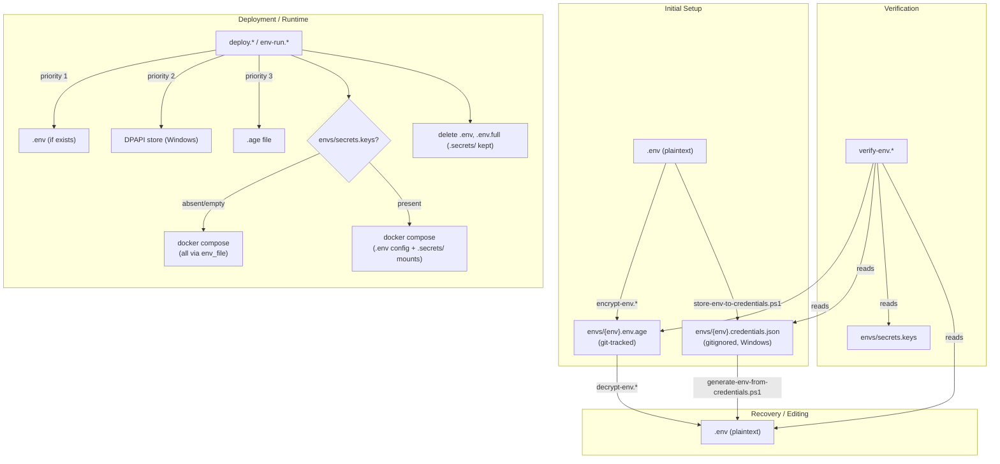
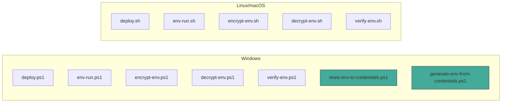

# Knowledge: Environment Workflow Scripts

## Overview

The core of `secure-env-handle` is a set of 12 scripts (7 PowerShell for Windows, 5 Bash for Linux/macOS) that manage the full lifecycle of environment secrets: encryption, storage, decryption, verification, deployment, and ad-hoc command execution.

**Languages:** PowerShell 5.1+, Bash (set -euo pipefail)
**External dependencies:** `age` (encryption), Docker/Docker Compose (deployment), Windows DPAPI (credential store)

All scripts live at the repo root and are installed into target projects under `secure-env-handle-and-deploy/` by `init-env-handle.ps1` / `.sh`.

---

## Implementation Details

### Script Inventory

| Script | Platform | Purpose |
|--------|----------|---------|
| `deploy.ps1` | Windows | Interactive deploy: load env, split secrets, docker compose up, cleanup |
| `deploy.sh` | Linux | Same as above (no DPAPI tier) |
| `env-run.ps1` | Windows | Scriptable: load env, split secrets, run any command, cleanup |
| `env-run.sh` | Linux | Same as above (no DPAPI tier) |
| `encrypt-env.ps1` | Windows | `.env` -> `envs/{env}.env.age` (age passphrase) |
| `encrypt-env.sh` | Linux | Same |
| `decrypt-env.ps1` | Windows | `envs/{env}.env.age` -> `.env` + `.secrets/` (auto-split; `-Full` skips) |
| `decrypt-env.sh` | Linux | Same (`--full` flag) |
| `verify-env.ps1` | Windows | Compare .env, DPAPI, age layers + manifest awareness |
| `verify-env.sh` | Linux | Compare .env, age layers + manifest awareness |
| `store-env-to-credentials.ps1` | Windows | `.env` -> `envs/{env}.credentials.json` (DPAPI per-entry) |
| `generate-env-from-credentials.ps1` | Windows | `envs/{env}.credentials.json` -> `.env` |

### Three-Tier Env Source Priority

Used by `deploy.*` and `env-run.*` when loading secrets:

1. **Existing `.env` file** -- used as-is (allows manual edits, highest priority)
2. **DPAPI credential store** (`envs/{env}.credentials.json`) -- Windows only, no passphrase, machine-bound
3. **age-encrypted file** (`envs/{env}.env.age`) -- cross-platform, prompts for passphrase

### Core Patterns

#### Cleanup Behavior
- If `.env` was **pre-existing**, scripts leave it untouched
- If `.env` was **created** from DPAPI/age, scripts delete it after use
- `deploy.*` offers an interactive delete prompt; `env-run.*` auto-cleans via finally/trap
- `.env.full` (intermediate) is always deleted
- `.secrets/` **persists** while containers run (bind-mount); deleted only on `docker compose down` via env-run

#### Docker Secrets Split (v1.5.0+)
All sources load into `.env.full` first — secrets never touch `.env`:
- When `envs/secrets.keys` manifest exists and is non-empty:
  - `.env.full` is split into `.env` (config only) and `.secrets/{KEY}` (secrets)
  - `.env` never contains secret values, not even temporarily
- Both `.env.full` and `.secrets/` are cleaned up after deploy/env-run
- If manifest is absent or empty: `.env.full` is moved to `.env` (all content)
- `decrypt-env` also auto-splits when manifest exists (`-Full`/`--full` to skip)

See: [knowledge-docker-secrets-split.md](knowledge-docker-secrets-split.md)

#### Safety Gates (env-run only)
Destructive commands require typed confirmation words:
- Commands containing `migrate` -> must type "migrate"
- Commands matching `down -v`, `volume prune`, `system prune`, `reset` -> must type "reset"

#### DPAPI Storage Model (Windows)
- Each `.env` key-value pair is encrypted individually via `System.Security.Cryptography.ProtectedData`
- Scope: `CurrentUser` (tied to Windows user profile + machine)
- Stored as Base64-encoded encrypted bytes in JSON
- Cannot be decrypted on a different machine or by a different user

#### age Encryption Model
- Passphrase-based: scrypt KDF + ChaCha20-Poly1305
- No key management needed -- just a passphrase (stored externally in PasswordDepot)
- `.age` files are binary, safe to commit to git

### Execution Flow: deploy.ps1

```
Start
  |
  v
Prompt: select environment (dev/prod)
  |
  v
Check .env exists? ----yes----> copy to .env.full
  |no
  v
Check credentials.json? --yes--> DPAPI decrypt each entry -> write .env.full
  |no
  v
Check .env.age? ------yes-----> age --decrypt (prompt passphrase) -> write .env.full
  |no
  v
ERROR: no env source found
  |
  v
Split-EnvSecrets (reads .env.full → .env config + .secrets/)
  |    ↑ no manifest? → move .env.full to .env
  v
docker compose up --build -d
  |
  v
Offer: save to credential store? (reads .env.full for complete key set)
  |
  v
Offer: delete .env from disk?
  |
  v
Cleanup: delete .env.full, .secrets/ (if split was performed)
  |
  v
Done
```

### Execution Flow: env-run.ps1

```
Start (args: EnvName, Command)
  |
  v
Validate params
  |
  v
Detect destructive command? --yes--> require confirmation word
  |
  v
Track: did .env already exist? (envCreated flag)
  |
  v
Load → .env.full (same 3-tier priority)
  |
  v
Split-EnvSecrets (split .env.full → .env config + .secrets/)
  |
  v
Invoke-Expression $Command
  |
  v
Finally: if envCreated -> delete .env
         always: delete .env.full
         .secrets/: deleted only if command matches "down"
  |
  v
Exit with command's exit code
```

### Execution Flow: verify-env

```
Start (arg: EnvName)
  |
  v
Detect layers: .env, credentials.json, .env.age
  |
  v
Decrypt available layers into memory
  |
  v
Load envs/secrets.keys manifest (if present)
  |
  v
Compare all keys across layers:
  - In sync / mismatch / missing
  - Type column: secret / config (if manifest exists)
  |
  v
Warn: manifest keys not found in any layer
Suggest: keys that look sensitive but aren't in manifest
  |
  v
Summary: layers compared, totals, status
```

---

## Dependencies

### Internal (script-to-script)

```
encrypt-env.* <-------> decrypt-env.*          (encrypt/decrypt pair)
store-env-to-credentials <-> generate-env-from-credentials  (DPAPI pair)

deploy.* / env-run.* reads from:
  - envs/{env}.credentials.json (via inline DPAPI logic)
  - envs/{env}.env.age (via age CLI)
  - envs/secrets.keys (for Docker secrets split)

verify-env.* reads from:
  - .env, credentials.json, .env.age (layer comparison)
  - envs/secrets.keys (manifest classification)
```

### External

| Dependency | Required By | Purpose |
|------------|-------------|---------|
| `age` | encrypt/decrypt scripts, deploy/env-run (tier 3) | Passphrase-based encryption |
| Docker + Compose | deploy, env-run | Container orchestration |
| DPAPI (`System.Security`) | store/generate credentials, deploy.ps1, env-run.ps1, verify-env.ps1 | Windows-native encryption |
| `PasswordDepot` | Human operator | External passphrase storage for age |

---

## Visual Diagrams

### Secret Lifecycle



### Platform Feature Matrix



*Green = Windows-only (DPAPI). Linux has no credential store equivalent -- relies on age passphrase.*

---

## Additional Insights

### Security Model

| Threat | Protection |
|--------|------------|
| Secrets in git history | `.env` gitignored; only encrypted `.age` files committed |
| Git repo compromised | `.age` files need passphrase to decrypt |
| Server compromised (offline) | DPAPI files unreadable without Windows user profile |
| `.env` on disk | Deleted after deploy/env-run; never contains secrets when manifest exists |
| Secrets in docker inspect/logs | Optional `/run/secrets/` file mounts via manifest |
| Machine destroyed | Recover from `.age` in git + passphrase from PasswordDepot |

### Design Decisions

- **deploy is interactive, env-run is scriptable** -- deploy handles the common "stand up the stack" flow with prompts; env-run is a single-command wrapper for CI/scripts/ad-hoc use.
- **DPAPI is convenience, age is portability** -- DPAPI avoids passphrase fatigue on dev machines; age is the cross-platform/cross-machine fallback.
- **No per-environment compose files** -- a single `docker-compose.yml` uses `${VAR}` substitution; environment differences live entirely in the encrypted env files.
- **Cleanup is conditional** -- scripts track whether they created `.env` or found it pre-existing, to avoid deleting the user's manual edits. Same pattern for `.secrets/`.
- **Docker secrets split is opt-in** (v1.5.0) -- only activates when `envs/secrets.keys` exists and is non-empty. Zero disruption to existing projects.
- **Split helper is duplicated** -- the same function exists in all 4 deploy/env-run scripts rather than being sourced from a shared file. Keeps each script self-contained.

### Potential Risks

- `env-run.ps1` uses `Invoke-Expression` / `env-run.sh` uses `eval` -- these execute arbitrary commands. This is intentional (the script's purpose), but the input comes from the local operator, not untrusted sources.
- DPAPI `.credentials.json` stores encrypted values but key names are plaintext -- key names are visible if the file is leaked.
- If deploy crashes mid-split, `.env.full` may remain on disk (contains all secrets). Cleanup on next run handles this.

---

## Metadata

| Field | Value |
|-------|-------|
| Analysis date | 2026-03-27 |
| Depth | Full (all 12 scripts) |
| Files analyzed | deploy.ps1, deploy.sh, env-run.ps1, env-run.sh, encrypt-env.ps1, encrypt-env.sh, decrypt-env.ps1, decrypt-env.sh, verify-env.ps1, verify-env.sh, store-env-to-credentials.ps1, generate-env-from-credentials.ps1 |
| Repo version | v1.5.0 |
| Related knowledge | [knowledge-docker-secrets-split.md](knowledge-docker-secrets-split.md), [knowledge-init-env-handle.md](knowledge-init-env-handle.md) |

---

## Next Steps

- **Deeper dive candidates:** Individual script internals, verify-env heuristic tuning
- **Possible improvements:** Automated secret rotation, CI/CD integration patterns
