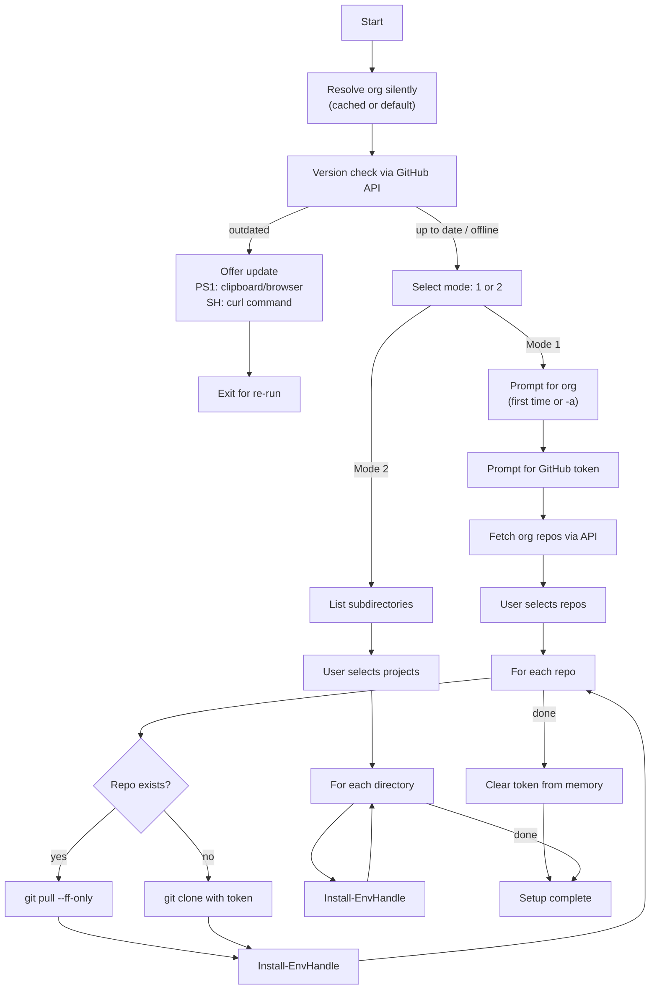
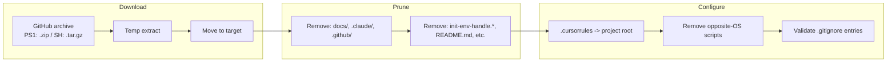

# Knowledge: init-env-handle (PS1 + SH)

## Overview

The bootstrap/installer scripts for the `secure-env-handle` project. Two platform variants exist with identical logic:

| Script | Platform | Archive format | Extra dependencies |
|--------|----------|----------------|--------------------|
| `init-env-handle.ps1` | Windows (PowerShell 5.1+) | `.zip` via `Invoke-WebRequest` + `Expand-Archive` | -- |
| `init-env-handle.sh` | Linux/macOS (Bash 4+) | `.tar.gz` via `curl` + `tar` | `jq` (Mode 1 + version check) |

Both provision target project directories with env-handle workflow scripts. They run interactively from a workspace root and operate on subdirectories.

**Entry points:** `.\init-env-handle.ps1 [-a]` or `./init-env-handle.sh [-a]`
**Flag:** `-a` forces re-prompt for GitHub organisation (Mode 1 only)

---

## Implementation Details

### Global State

| Variable (PS1 / SH) | Purpose |
|----------------------|---------|
| `$Version` / `VERSION` | Pinned semver, embedded in script. Must match a git tag. |
| `$defaultOrg` / `DEFAULT_ORG` | Fallback org name (`Grebec-IT`) |
| `$configPath` / `CONFIG_PATH` | Path to `~/.secure-env-handle.json` (org cache) |
| `$targetDir` / `TARGET_DIR` | Working directory where script is invoked |

**Removed in v1.3.0+:** `$envHandleRepo` -- no longer needed after switching from `git clone` to archive download.

### Organisation Resolution

The GitHub org name is configurable and cached in `~/.secure-env-handle.json`:

```json
{ "org": "Grebec-IT" }
```

**Resolution flow:**
1. On startup: resolve silently (cached value or `$defaultOrg`) -- used only for the version check URL
2. **Mode 1 only**: prompt interactively if first time or `-a` flag; cache the result
3. **Mode 2**: never prompts, uses whatever was resolved silently

### Functions

#### `Invoke-Git` (PS1 only)

Wraps `git` via `Start-Process` to prevent PowerShell from intercepting stderr (git writes progress/warnings to stderr, which PowerShell treats as errors). Returns the process exit code. Not needed in bash.

#### `Install-EnvHandle` / `install_env_handle`

The core function. Downloads and installs env-handle scripts into a target project. Steps:

1. **Clean** -- removes existing `secure-env-handle-and-deploy/` if present
2. **Download** -- fetches GitHub archive for the pinned tag version (`.zip` on Windows, `.tar.gz` on Linux). No git clone, no `.git` directory.
3. **Extract** -- extracts to temp, moves inner folder to target path, cleans up temp files
4. **Validate** (SH only) -- verifies the download is a real tarball, not a 404 HTML page
5. **Prune directories** -- removes `docs/`, `.claude/`, `.github/` (source repo artifacts)
6. **Prune files** -- removes `init-env-handle.ps1`, `init-env-handle.sh`, `setup-server.ps1`, `README.md`, `env_handling.md`, `CLAUDE.md`, `LICENSE`
7. **Copy .cursorrules** -- moves to project root (Cursor IDE reads from root only)
8. **OS filter** -- Windows: removes `.sh` scripts. Linux: removes `.ps1` scripts.
9. **Gitignore validation** -- checks for required entries (`.env`, `*.credentials.json`, `secure-env-handle-and-deploy/`), prompts to append if missing

### Main Script Flow



### Mode 1: Pull Git Repos + Setup

Server provisioning workflow:

1. Prompts for GitHub organisation (first time or `-a`; cached otherwise)
2. Prompts for a GitHub fine-grained token (PS1: `SecureString`, SH: `read -s`)
3. Fetches all accessible repos via `GET /user/repos`, filters to the org, excludes `secure-env-handle` itself
4. User selects repos (comma-separated numbers or "A" for all)
5. For each repo: clone (or pull if exists) using token-authenticated URL
6. Runs `Install-EnvHandle` for each repo
7. Clears token from memory (PS1: `$null` + `[GC]::Collect()`, SH: `token=""`)

### Mode 2: Setup Env Handle Only

Development / existing project workflow:

1. Lists non-hidden subdirectories in current directory (excludes `.`-prefixed and `secure-env-handle`)
2. User selects projects (comma-separated numbers or "A" for all)
3. Runs `Install-EnvHandle` for each selected directory
4. **No org prompt** -- uses cached/default org silently for archive download

### Version Check

On startup, queries GitHub API for the latest tag (uses silently resolved org):
- If current: shows green confirmation
- If outdated: offers update paths:
  - **PS1**: C) Copy raw download URL to clipboard, B) Open releases page in browser
  - **SH**: Shows `curl` download command
- Cannot self-update while running (PS1: file lock, SH: same principle), so exits for manual re-run
- Gracefully handles offline (5s timeout, continues with current version)
- **SH only**: skips version check entirely if `jq` is not installed

---

## Dependencies

### Internal

| Dependency | Used By | Purpose |
|------------|---------|---------|
| `Invoke-Git` (PS1) | Mode 1 (clone/pull) | Safe git execution avoiding PowerShell stderr issues |
| `Install-EnvHandle` / `install_env_handle` | Both modes | Script deployment into target projects |

### External

| Dependency | Required By | Platform | Purpose |
|------------|-------------|----------|---------|
| `git` | Mode 1 only | Both | Clone/pull project repos |
| `curl` | All | SH only | Download archive + API calls |
| `tar` | Install-EnvHandle | SH only | Extract `.tar.gz` |
| `jq` | Version check, Mode 1 | SH only | JSON parsing |
| `Invoke-WebRequest` | Install-EnvHandle | PS1 only | Download `.zip` archive |
| `Expand-Archive` | Install-EnvHandle | PS1 only | Extract `.zip` |
| GitHub API | Version check, Mode 1 | Both | Tag listing + repo discovery |
| GitHub fine-grained token | Mode 1 only | Both | Authenticate private repo access |

### GitHub API Endpoints Used

| Endpoint | Auth | Purpose |
|----------|------|---------|
| `GET /repos/{org}/secure-env-handle/tags?per_page=1` | None (public) | Version check |
| `GET /user/repos?per_page=100` | Bearer token | List accessible repos (Mode 1) |
| `GET /{org}/secure-env-handle/archive/refs/tags/v{ver}.zip` | None (public) | Download scripts (PS1) |
| `GET /{org}/secure-env-handle/archive/refs/tags/v{ver}.tar.gz` | None (public) | Download scripts (SH) |

---

## Visual Diagrams

### Install-EnvHandle Pipeline



### What Gets Installed

```
<project>/
  .cursorrules                          (copied to root)
  .gitignore                            (entries appended if missing)
  secure-env-handle-and-deploy/
    CLAUDE.md                           (agent instructions)
    .cursorrules

    # Windows (PS1 install):
    deploy.ps1
    env-run.ps1
    encrypt-env.ps1
    decrypt-env.ps1
    store-env-to-credentials.ps1
    generate-env-from-credentials.ps1

    # Linux (SH install):
    deploy.sh
    env-run.sh
    encrypt-env.sh
    decrypt-env.sh
```

---

## Platform Differences

| Aspect | PS1 (Windows) | SH (Linux) |
|--------|---------------|------------|
| Archive format | `.zip` + `Expand-Archive` | `.tar.gz` + `tar` |
| JSON config read | `ConvertFrom-Json` | `sed` regex |
| JSON config write | `ConvertTo-Json \| Set-Content` | `printf` |
| API JSON parsing | `Invoke-RestMethod` (native) | `jq` (external) |
| Token input | `SecureString` | `read -s` (hidden) |
| OS filter | removes `.sh` files | removes `.ps1` files |
| Self-update offer | clipboard / browser | shows `curl` command |
| Version check without deps | always works | skipped if `jq` missing |
| Tarball validation | not needed (Expand-Archive fails on invalid) | `tar tzf` check before extract |
| Colors | PowerShell `-ForegroundColor` | ANSI escape codes |
| Token cleanup | `$null` + `[GC]::Collect()` | `token=""` |

---

## Additional Insights

### Security Considerations

- **Token handling**: PS1 reads as `SecureString`, SH uses `read -s`. Both clear token after use.
- **Token in clone URL**: `x-access-token:{token}@github.com` -- visible in process list during clone, but short-lived
- **No token persistence**: never written to disk or stored beyond the session
- **Gitignore enforcement**: actively checks and prompts to add security-critical entries

### Design Decisions

- **Zip/tar download over git clone** (v1.3.0): eliminates detached HEAD warnings and `.git` directory. No git needed for script installation, only for project repo cloning in Mode 1.
- **Org prompt in Mode 1 only**: Mode 2 works on local directories and doesn't need org selection. The archive download URL uses the cached/default org silently.
- **Configurable org with cache** (v1.4.0-dev): first run prompts, subsequent runs use cached value. `-a` flag forces re-prompt. Stored in `~/.secure-env-handle.json`.
- **Cannot self-update**: script is locked while running (PS1) or should be replaced cleanly (SH). The update flow provides the URL/command and exits.
- **OS filtering**: ships all scripts but removes the wrong platform's scripts on install.
- **Interactive gitignore**: prompts rather than silently modifying.

---

## Metadata

| Field | Value |
|-------|-------|
| Analysis date | 2026-03-27 |
| Depth | Full (both platform variants, all functions and flows) |
| Files analyzed | init-env-handle.ps1, init-env-handle.sh |
| Repo version | v1.3.0 (unreleased changes pending for v1.4.0) |
| Related knowledge | [knowledge-env-workflow-scripts.md](knowledge-env-workflow-scripts.md), [knowledge-repo-overview.md](knowledge-repo-overview.md) |

---

## Next Steps

- **Deeper dive candidates**: Version check / self-update mechanism, GitHub token scoping requirements
