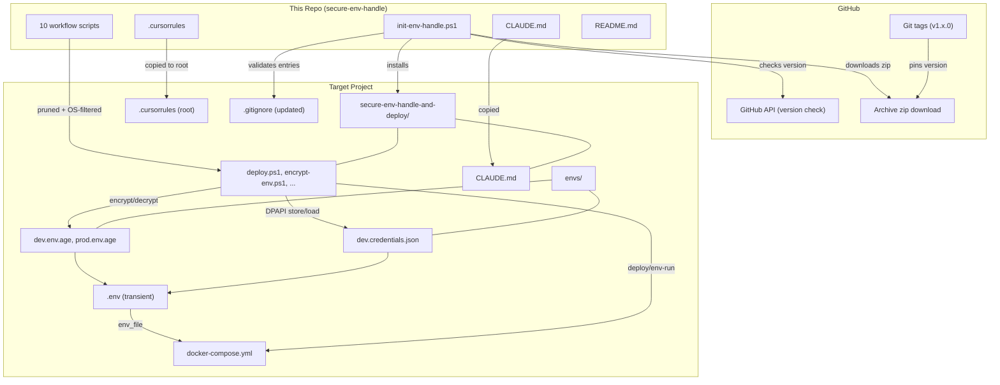

# Knowledge: Repository Overview

## Overview

`secure-env-handle` is a script library for managing Docker project secrets across Windows and Linux. It provides encrypted environment variable storage, deployment automation, and per-project script installation -- not an application itself.

**Languages:** PowerShell 5.1+, Bash
**License:** MIT (Grebec-IT, 2026)
**Distribution:** Git tags (semver), installed into target projects via `init-env-handle.ps1`
**Current version:** v1.3.0

---

## Repository Structure

```
secure-env-handle/
├── .claude/
│   └── settings.local.json              Claude Code permissions (git ops, gh api)
├── .cursorrules                          Cursor IDE agent instructions (copied to target projects)
├── docs/
│   └── ai/
│       ├── design/                       Feature design docs
│       ├── implementation/               Knowledge docs (this folder)
│       ├── planning/                     Feature task breakdowns
│       └── requirements/                 Feature requirements
├── CLAUDE.md                             Claude Code agent instructions (for this repo + target projects)
├── LICENSE                               MIT
├── README.md                             User-facing documentation
├── SECURITY.md                           Vulnerability reporting policy
│
├── init-env-handle.ps1                   Bootstrap: install scripts into target projects
│
├── deploy.ps1 / deploy.sh               Load env + docker compose up + cleanup
├── env-run.ps1 / env-run.sh             Load env + run any command + cleanup
├── encrypt-env.ps1 / encrypt-env.sh     .env -> envs/{env}.env.age
├── decrypt-env.ps1 / decrypt-env.sh     envs/{env}.env.age -> .env
├── store-env-to-credentials.ps1         .env -> DPAPI credential store (Windows)
└── generate-env-from-credentials.ps1    DPAPI credential store -> .env (Windows)
```

---

## How Everything Connects



---

## Three Layers of the System

### 1. Distribution Layer (`init-env-handle.ps1`)

The bootstrap script that installs everything into target projects. Runs from a workspace root, operates on subdirectories.

- **Mode 1**: Clone org repos via GitHub token + install env-handle scripts
- **Mode 2**: Install env-handle scripts into existing project directories
- Downloads tagged zip from GitHub (no git clone, no `.git` directory)
- Prunes repo-only artifacts, filters by OS, validates `.gitignore`
- Configurable org name (cached in `~/.secure-env-handle.json`, `-a` to re-prompt)

See: [knowledge-init-env-handle.md](knowledge-init-env-handle.md)

### 2. Secret Management Layer (encrypt/decrypt/credentials scripts)

Handles the encryption lifecycle of `.env` files.

| Flow | Scripts | Storage |
|------|---------|---------|
| Encrypt for git | `encrypt-env.*` | `envs/{env}.env.age` (committed) |
| Decrypt from git | `decrypt-env.*` | `.env` (transient) |
| Store in DPAPI | `store-env-to-credentials.ps1` | `envs/{env}.credentials.json` (gitignored) |
| Load from DPAPI | `generate-env-from-credentials.ps1` | `.env` (transient) |

### 3. Execution Layer (deploy/env-run scripts)

Loads secrets and runs Docker commands.

- **deploy.\***: Interactive "stand up the stack" with env selection and cleanup prompts
- **env-run.\***: Scriptable single-command wrapper with safety gates for destructive ops
- Both use three-tier env source priority: existing `.env` > DPAPI > age
- Both auto-cleanup `.env` if they created it

See: [knowledge-env-workflow-scripts.md](knowledge-env-workflow-scripts.md)

---

## Agent Instruction Files

Two parallel files serve different AI coding assistants. **They must always be identical** -- the user uses both tools and needs consistent behavior.

| File | Target | Placement |
|------|--------|-----------|
| `CLAUDE.md` | Claude Code | Copied into `secure-env-handle-and-deploy/` in target projects |
| `.cursorrules` | Cursor IDE | Copied to target project root (Cursor only reads from root) |

Content: rules for handling env vars, docker-compose conventions, script reference, security model. Written in agent-instruction style (imperative rules, not prose). When editing one, always update the other.

---

## Feature Documentation (docs/ai/)

Two features have been tracked through requirements -> design -> planning:

| Feature | Purpose | Status |
|---------|---------|--------|
| `feature-agent-env-docs` | Auto-copy agent instructions to target projects | Implemented |
| `feature-versioning-and-gitignore` | Semver tags, version pinning, gitignore validation | Implemented |

---

## Versioning & Release Model

- **Scheme**: Git tags, semver (`v1.0.0`, `v1.1.0`, etc.)
- **Pinning**: `$Version` variable in `init-env-handle.ps1` determines which tag is downloaded
- **Version check**: On startup, queries GitHub API for latest tag, offers update if outdated
- **Self-update limitation**: PowerShell locks the running script; update flow provides URL and exits

Release workflow:
1. Update `$Version` in `init-env-handle.ps1`
2. Commit
3. `git tag -a v{X.Y.Z} -m "v{X.Y.Z}: description"`
4. `git push && git push --tags`

---

## Security Model

| Threat | Protection |
|--------|------------|
| Secrets in git history | `.env` gitignored; only encrypted `.age` files committed |
| Git repo compromised | `.age` files need passphrase to decrypt |
| Server compromised (offline) | DPAPI files unreadable without Windows user profile |
| `.env` on disk | Deleted after deploy/env-run; only exists briefly |
| Machine destroyed | Recover from `.age` in git + passphrase from PasswordDepot |
| Vulnerability found | SECURITY.md: private advisory or email, 48h ack, 7d fix SLA |

---

## What This Repo Is NOT

- **Not an application** -- it's a script library installed into other projects
- **Not a global tool** -- scripts are copied per-project (each project gets its own copy)
- **Not cross-platform for DPAPI** -- DPAPI scripts are Windows-only; Linux uses age only
- **No CI/CD** -- no `.github/workflows`, no automated testing
- **No .gitignore at repo root** -- intentional; everything in this repo is committed (scripts, docs, agent instructions). The gitignore validation in `Install-EnvHandle` targets the implementing projects, not this repo

---

## Metadata

| Field | Value |
|-------|-------|
| Analysis date | 2026-03-27 |
| Depth | Full repository |
| Files analyzed | All non-script files, directory structure, docs/ai/ tree |
| Repo version | v1.3.0 |
| Related knowledge | [knowledge-init-env-handle.md](knowledge-init-env-handle.md), [knowledge-env-workflow-scripts.md](knowledge-env-workflow-scripts.md) |

---

## Next Steps

- **CI/CD**: No automated testing or linting exists -- could add GitHub Actions for shellcheck/PSScriptAnalyzer
