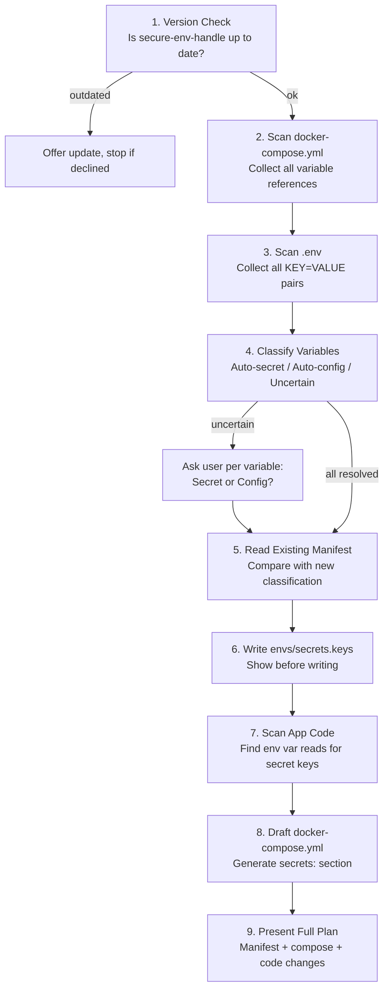
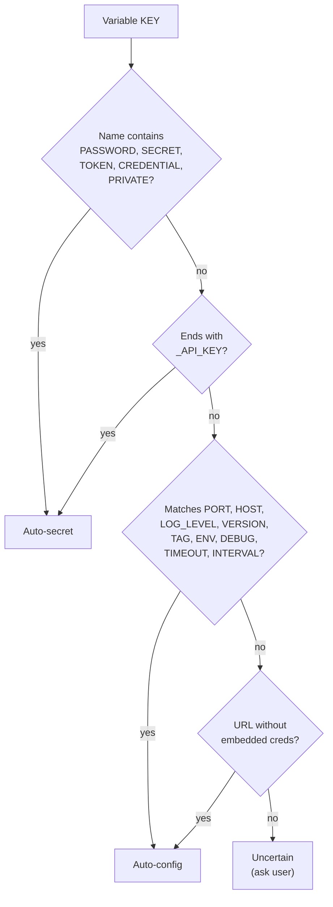

# Knowledge: /suggest-secret-variable-split Skill

## Overview

A Claude Code slash command that assists migrating a target project to Docker
secret file mounts. It scans the project's docker-compose, .env, and
application code, classifies variables, populates the `envs/secrets.keys`
manifest, and drafts all required changes.

**Type:** Claude Code custom command (prompt-based, no executable code)
**File:** `.claude/commands/suggest-secret-variable-split.md`
**Runs in:** Target projects (not in the secure-env-handle repo itself)
**Shipped via:** `init-env-handle` copies it to `secure-env-handle-and-deploy/.claude/commands/`
**Added in:** v1.5.0

---

## Implementation Details

The skill is a markdown prompt file -- Claude Code reads it and follows the
instructions step by step. It contains no executable code; the AI agent
performs all scanning, classification, and drafting.

### 9-Step Flow



### Step 1: Version Check

Reads `secure-env-handle-and-deploy/CLAUDE.md` and checks for the "Docker
Secret File Mounts" section. If absent, the installed version predates v1.5.0
and can't handle the manifest. Offers to update via init-env-handle re-run.

### Step 2: Scan docker-compose.yml

Searches for `docker-compose.yml`, `compose.yml`, and variants. For each
service collects:
- Variables from `env_file:` references
- Variables from `environment:` sections (both `KEY=VALUE` and `${KEY}` forms)
- Any existing `secrets:` configuration (the project may already have some)
- Service names and images (useful for knowing which apps need code changes)

### Step 3: Scan .env

Reads `.env` if present. If not, checks `envs/` for `.credentials.json` or
`.env.age` and tells the user to decrypt first. Collects all key-value pairs.

### Step 4: Classify Variables

Three-tier heuristic classification:

| Category | Heuristic | Action |
|----------|-----------|--------|
| **Auto-secret** | Key contains `PASSWORD`, `SECRET`, `TOKEN`, `CREDENTIAL`, `PRIVATE`, or ends with `_API_KEY` | Add to manifest automatically |
| **Auto-config** | Key matches `PORT`, `HOST`, `LOG_LEVEL`, `VERSION`, `TAG`, `ENV`, `DEBUG`, `TIMEOUT`, `INTERVAL`; or URL without embedded credentials | Keep in .env automatically |
| **Uncertain** | `DATABASE_URL` (may embed credentials), bare `KEY` in name, anything else unmatched | Ask user: Secret or Config? |

For uncertain variables, presents each one with context:
> `DATABASE_URL` -- contains a connection string that may embed credentials.
> Classify as: [S]ecret / [C]onfig?

**Design note:** bare `KEY` in a name (e.g., `CACHE_KEY`, `PRIMARY_KEY`) is
treated as uncertain, not auto-secret. Only `_API_KEY` suffix is high-confidence.

### Step 5: Read Existing Manifest

If `envs/secrets.keys` already exists, loads it and compares:
- New keys to add (classified as secret but not in manifest)
- Keys to remove (in manifest but no longer classified as secret)
- Unchanged keys

### Step 6: Write/Update Manifest

Writes `envs/secrets.keys` with category comments for readability:

```
# Database
POSTGRES_PASSWORD

# API tokens
WECLAPP_API_TOKEN
WEBHOOK_SECRET_TOKEN

# Application
SECRET_KEY
```

Shows the full content to the user before writing.

### Step 7: Scan App Code

Searches project source code for patterns that read the now-classified secret
keys as environment variables:

| Language | Patterns searched |
|----------|-------------------|
| Python | `os.getenv("KEY")`, `os.environ["KEY"]`, `os.environ.get("KEY")`, `decouple.config("KEY")`, pydantic `BaseSettings` field name matching |
| JavaScript/TS | `process.env.KEY` |
| Shell | `$KEY`, `${KEY}` |
| Go | `os.Getenv("KEY")` |
| Java | `System.getenv("KEY")` |
| Docker/Compose | `${KEY}` in `environment:` sections |

For each match, notes:
- File path and line number
- Current pattern
- Required change (read from `/run/secrets/{key}` with env var fallback)

### Step 8: Draft docker-compose.yml Changes

Generates the `secrets:` additions needed:

```yaml
# Top-level secrets block
secrets:
  postgres_password:
    file: .secrets/POSTGRES_PASSWORD

# Per-service additions
services:
  app:
    secrets:
      - postgres_password
```

Presented as a diff or code block, not applied automatically.

### Step 9: Present Full Plan

Summary with four sections:
1. **Manifest** -- the `envs/secrets.keys` content (already written in step 6)
2. **docker-compose.yml changes** -- the secrets section to add
3. **App code changes** -- files, lines, before/after examples
4. **Testing checklist** -- steps to verify the migration works

User reviews and confirms before any code changes are made.

---

## Dependencies

### Required in Target Project

| Dependency | Purpose |
|------------|---------|
| `secure-env-handle-and-deploy/CLAUDE.md` | Version detection (must contain "Docker Secret File Mounts" section) |
| `docker-compose.yml` / `compose.yml` | Variable reference scanning |
| `.env` (or encrypted equivalent) | Key-value pair collection |
| Project source code | App code pattern scanning |

### Does NOT Depend On

- Running Docker containers (reads files only, doesn't execute)
- DPAPI or age (reads `.env` if present, doesn't decrypt)
- Any external APIs or services

---

## Visual Diagrams

### Classification Decision Tree



### Output Artifacts

```
Skill produces:
  envs/secrets.keys         ← written (with user approval)

Skill drafts (not written):
  docker-compose.yml diff   ← user applies manually
  App code change plan       ← user/agent executes per-project
```

---

## Additional Insights

### Design Decisions

- **Prompt-based, not executable**: The skill is a markdown instruction file,
  not a script. Claude Code's AI agent performs the work. This means it adapts
  to any project structure without hardcoded assumptions.
- **Write manifest, draft everything else**: The manifest is the only file the
  skill writes directly. Compose and app code changes are presented as plans
  for the user to review and apply. This avoids unintended changes to
  committed files.
- **Conservative heuristics**: The auto-secret list is intentionally narrow
  (6 patterns). Everything else is either auto-config or uncertain. False
  negatives (missed secrets) get caught by verify-env's heuristic suggestions.
- **Language-agnostic code scanning**: Patterns cover Python, JS/TS, Shell,
  Go, and Java. The AI agent can recognize additional patterns not explicitly
  listed.
- **Version gate**: Refuses to proceed if secure-env-handle is outdated,
  preventing users from creating a manifest that the deploy scripts can't
  process.

### Limitations

- **Requires .env to be decrypted**: If only `.env.age` or `.credentials.json`
  exist, the skill can't read variable values. It tells the user to decrypt
  first.
- **Heuristics are imperfect**: `S3_BUCKET_KEY` would be uncertain (contains
  `KEY` but not `_API_KEY`). The user resolves these interactively.
- **No runtime validation**: The skill doesn't test whether the app actually
  works with Docker secrets. The testing checklist in step 9 guides manual
  verification.
- **Single-project scope**: Runs in one project at a time. Shared secrets
  across projects (e.g., a database password used by multiple services) need
  the manifest created in each project separately.

---

## Metadata

| Field | Value |
|-------|-------|
| Analysis date | 2026-03-27 |
| Depth | Full (single file, all 9 steps) |
| Files analyzed | .claude/commands/suggest-secret-variable-split.md |
| Repo version | v1.5.0 |
| Related knowledge | [knowledge-docker-secrets-split.md](knowledge-docker-secrets-split.md), [knowledge-repo-overview.md](knowledge-repo-overview.md) |
| Feature docs | [feature-docker-secrets design](../design/feature-docker-secrets.md) |

---

## Next Steps

- **Test in a real project**: Run `/suggest-secret-variable-split` in sobekon-sync or sobekon-web-tools to validate classification accuracy and code scanning
- **Tune heuristics**: After real-world testing, adjust auto-secret/auto-config patterns based on false positives/negatives
- **Add framework-specific helpers**: The skill could suggest ready-made helper functions for common frameworks (Django `_get_secret()`, pydantic `SecretStr` validator)
